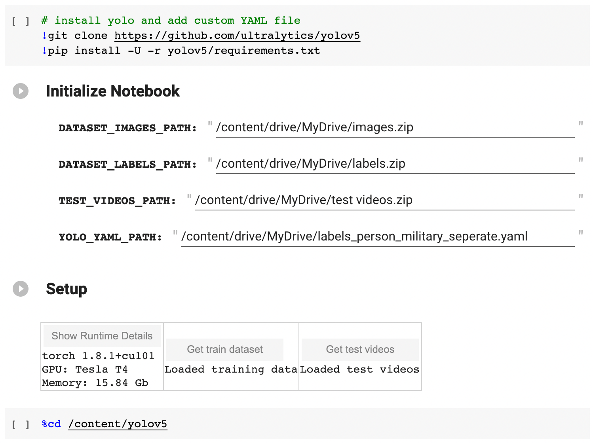
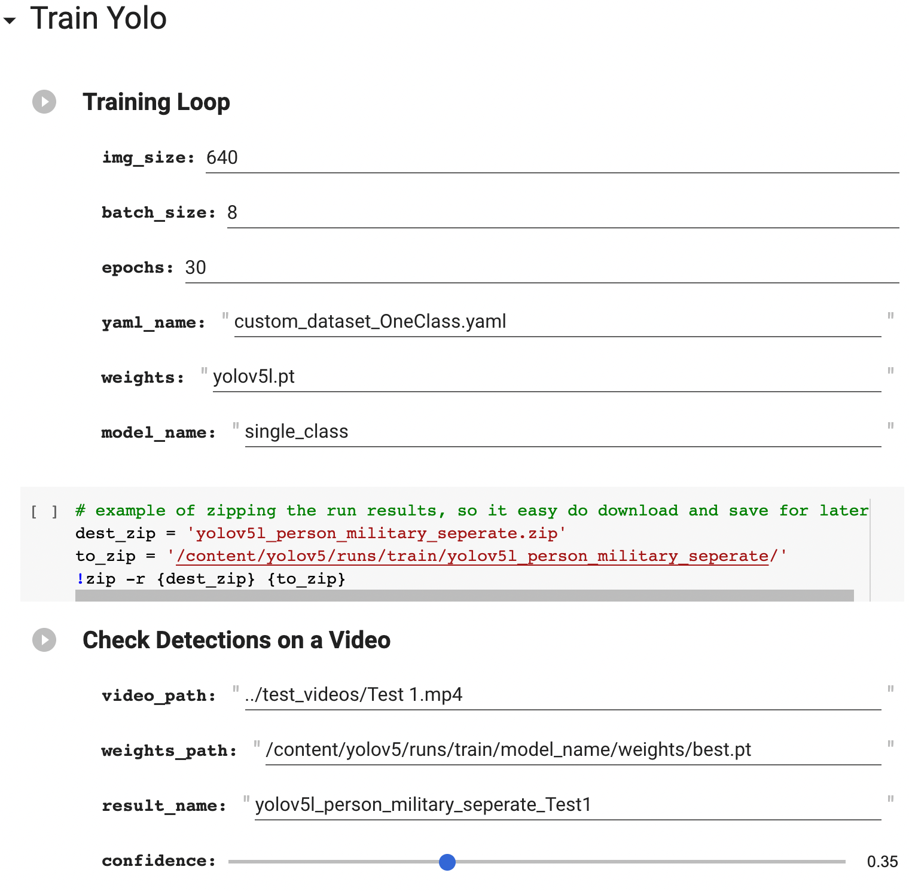

# Multiple Object Tracking of Military Vehicles

___
## Introduction
> This is the code for my project ___"Multiple Object Tracking for Military Vehicles"___, which is a part of my BSc in electrical engineering at Technion Israel. 
The project was done under the supervision of Gabi Davidov PhD - Thanks for his guidance and support durring the whole process.

The project can be divided into roughly 3 parts:

1. __Create a Custom Dataset__:
After looking online, one can see that a dataset for military vehicles detection can't be found.
Therefore, a custom dataset containing around 4000 images was collected and labeled for the project.

2. __Train an Object Detection Model__:
This project uses YOLOv5[[3]](#ref3) for object detection. As popular datasets used for training 
(such as COCO, ImageNet, etc.) have limited amount of military vehicles images, training an object on a custom dataset
is necessary.

3. __Combine with an Object Tracking Model__:
After obtaining the object detections (bounding box and class for the objects in each frame), the purpose of the tracking phase is to understand the relation between the objects over different frames. For this purpose, the DeepSort[[1]](#ref1) algorithm was chosen, with a pre-trained Pytorch implementation[[2]](#ref2).

<details>
  <summary><b> Repository Structure </b></summary>

```
├─ src
│  ├─ deep_sort_pytorch
│  ├─ utils
│  │  ├─ common_images_dataset_downloader.ipynb
│  │  ├─ download_Udacity_self_driving_car_dataset.ipynb
│  │  ├─ feature_matching_LoFTR.ipynb
│  │  ├─ Google_images.ipynb
│  │  ├─ Google_images.py
│  │  ├─ super_resolution.ipynb
│  │  ├─ super_resolution.py
│  │  └─ README.md
│  ├─ data_utils.py
│  ├─ plot_utils.py
│  ├─ tracker.py
│  └─ video.py
├─ figures
├─ notebooks
│  ├─ Compare Detectors.ipynb
│  ├─ test.ipynb
│  └─ Train YOLOv5.ipynb
└─ README.md
```
</details>


___
## Example


___
## Use the Object Tracker

The usage of the object tracking model is pretty straightforward, and should be similar to this snippet:

```python
import torch
from src.video import Video
from src.tracker import MultiObjectTracker
from src.plot_utils import plot_bounding_boxes

# initialize a video
video = Video(f'{test_videos_path}/{video_name}')

# initialize object detector
detector = torch.hub.load('ultralytics/yolov5', 'custom', weights_path).to(device)

# initialize object tracker
tracker = MultiObjectTracker(video, results_path, detector)

# iterate over the frames in the video
for frame, bounding_boxes in tracker:
    plot_bounding_boxes(frame, bounding_boxes)
    tracker.video_writer.write(frame)

# save the results
tracker.video_writer.release()
```

It's __recommended__ to check out the example notebook:
* Automatically download trained models and test videos (from this [Release](https://github.com/Lin-Sinorodin/Military_Vehicles_Tracking/releases/tag/v1.0.0))
* Show all steps required in order to run the detectors
* Display the results on the test videos after done the tracking
* Using __Google Colab__ Run all the code on the cloud and allows using free GPU

<div align="center">

| Content                        | Notebook                                   | 
|:------------------------------:|--------------------------------------------|
| Example of using the MOT model | [](https://colab.research.google.com/github/Lin-Sinorodin/Military_Vehicles_Tracking/blob/main/Military_Vehicles_Tracking.ipynb)|
  
</div>

___
## Train YOLOv5 Object Detection Model

> __Note:__ This explanation won't cover everything about training a YOLOv5 model, but all the necessary information can 
be found on the [YOLOv5 GitHub Repository](https://github.com/ultralytics/yolov5).


<details>
  <summary><b> How to Organize a YOLOv5 Dataset? </b></summary>
  
* All images and labels should be inside a folder named ```dataset```, located at the same level as the YOLO folder.
* Each image should have a matching label file, with the __same__ name and of ```.txt``` type.
```
├─ yolov5
└─ dataset
   ├─ images
   │  ├─ train
   │  │  ├─ file1.jpg
   │  │  └─ file2.jpg
   │  └─ val
   │     ├─ file3.jpg
   │     └─ file4.jpg
   └─ labels
      ├─ train
      │  ├─ file1.txt
      │  └─ file2.txt
      └─ val
         ├─ file3.txt
         └─ file4.txt
```

Each label file should contain all bounding boxes in the image, and looks similar to:
```
0 0.480109 0.631250 0.684532 0.713589
3 0.780210 0.325648 0.125679 0.456123
```
While:
* Only one bounding box per row.
* Each row represents a bounding box like: ```class x_center y_center width height```.
* Class values starting from 0.
* Bounding Box coordinates normalized between 0 and 1.
</details>


<details>
  <summary><b> How to Train on a Custom Dataset? </b></summary>

* For this project, I used Google Colab for the training. 
* The training pipeline is wrraped in Colab Forms, which allows using the code in gui-like environment, with minimal code:

<div align="center">

| Content                        | Notebook                                   | 
|:------------------------------:|--------------------------------------------|
| Train YOLOv5 on custom dataset | [](https://colab.research.google.com/github/Lin-Sinorodin/Military_Vehicles_Tracking/blob/main/Train_YOLO5.ipynb)|
  
</div>

__Note:__ double-clicking on a form in Colab reveals the code that running in the back. hide the code again by 
right-clicking on the cell and choose the ```hide code``` option in the ```forms``` tab.


> __The initialization:__


In order to initialize the training file, the following should be filled: 

| Content                        | Notebook                                   | 
|:------------------------------:|--------------------------------------------|
| ```DATASET_IMAGES_PATH```      | Path to the zip file containing the images |
| ```DATASET_LABELS_PATH```      | Path to the zip file containing the labels |
| ```TEST_VIDEOS_PATH```         | Path to the zip file containing the test videos (optional) |
| ```YOLO_YAML_PATH```           | Path to the ```.yaml``` with the YOLOv5 configuration |

Then, run the cells, and:
* Press the ```Show Runtime Details``` to ensure that GPU acceleration is on.
* Press the ```Get train dataset``` (it will download the dataset from the path given earlier).
* Press the ```Get test videos``` (Optional, only if going to run tests on videos).

> __The Training Loop:__


* After the training is done, the weights and run results can be zipped and downloaded.
* The trained model can now be used to inference on videos or images. See the YOLOv5 repository for more details.
</details>

___
## References
- <a name="ref1"> [[1]](https://arxiv.org/abs/1703.07402) Simple Online and Realtime Tracking with a Deep Association Metric.
- <a name="ref2"> [[2]](https://github.com/mikel-brostrom/Yolov5_DeepSort_Pytorch) (GitHub) mikel-brostrom/Yolov5_DeepSort_Pytorch
- <a name="ref3"> [[3]](https://github.com/ultralytics/yolov5) (GitHub) ultralytics/yolov5
